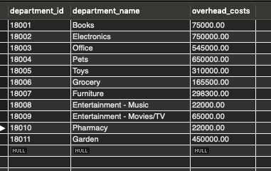

# Bamazon
A full-service online shopping app that includes a front-end customer order and two backend modules for Managers and Superivsors.

## Database
The sql database has two tables:
- products
- departments

## Customer Module
- View products: app calls products table in the database and displays to customer

- Customer can order by specifying product number and quantity

- Stock quantity in database is reduced by the appropriate quantity

**Database Before Purchase**

**Database After Purchase**: Stock quantity is reduced, product sales is increased

### NPM Packages Used
- msql2
- inquirer

## Manager Module
User has the following options:

- View Products: app calls products table in the database and displays to user

- View Products w/ Low Inventory: app calls products table in the database to display products with a stock quantity less than 100

- Add Inventory: allows user to increase the stock quantity in the products table in the database

**Database Before Add Inventory**

**Database After Add Inventory**: The stock quantity has increased

- Add Product: user is able to add a new product to the products table in the database

**Database Before Add Product**

**Database After Add Product**

### NPM Packages Used
- msql2
- inquirer

## Supervisor Module
User has the following options:

- View Sales: Produces a report that shows total sales and total profit, by department. **Note:** I didn't get this to work completely. The table is working, though the two main columns -- product sales by department and total profit by department are not on it.

- Create Department: allows user to add a new department to the department table in the database

**Database Before New Department**

**Database After New Department**

### NPM Packages Used
- msql2
- inquirer
- easy table